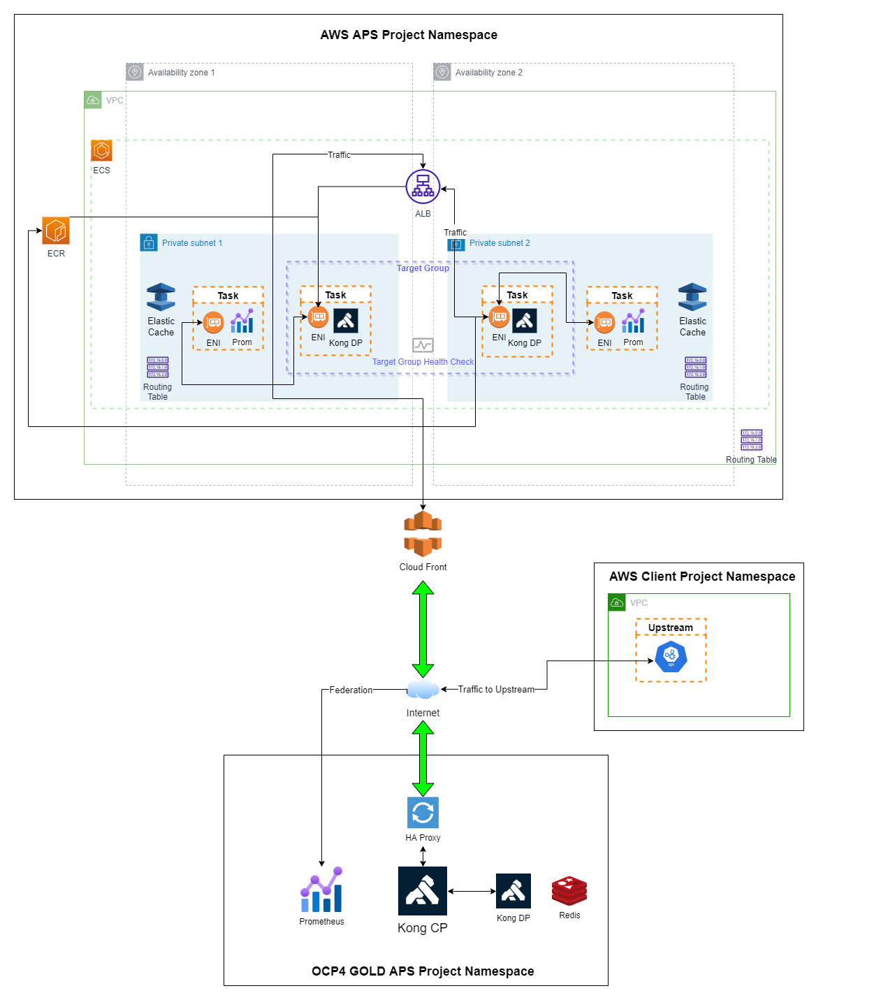
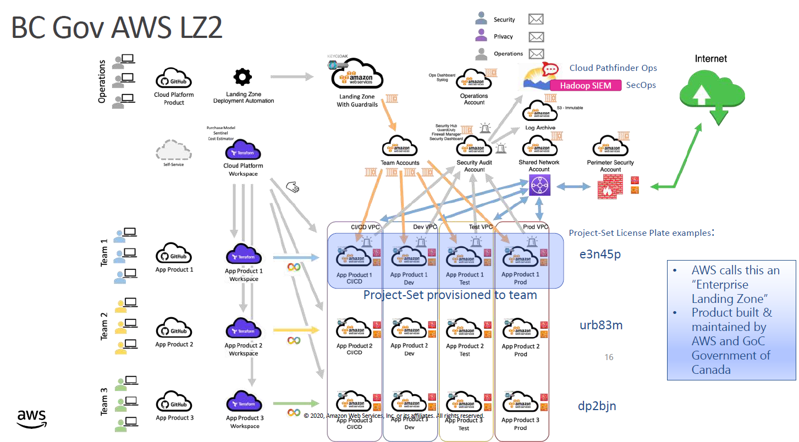
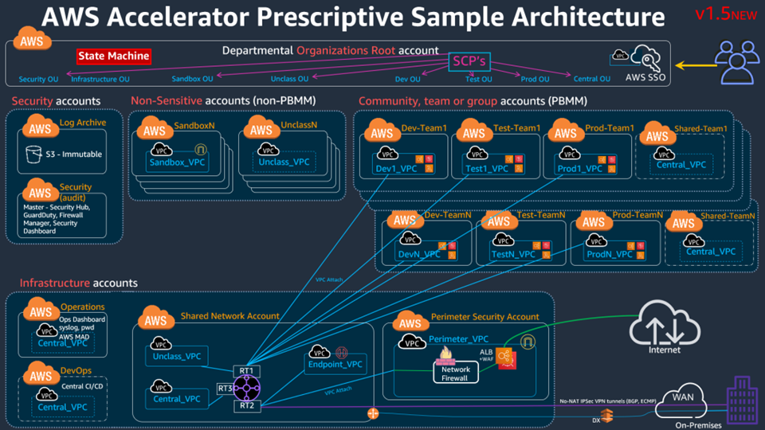
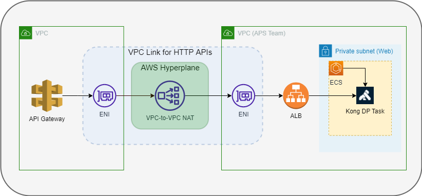

# Kong Installation in AWS



## AWS Project Set

- Every Team shall be assigned with 4 workspaces and they are sandbox, dev, test and prod
- Each workspace includes a VPC and 6 subnets, each for app, web and data
- The traffic out of subnets is flowing out to transit gateway (placed in SEA VPC) created by SEA
- A default application load balancer is provided

## Architecture



### Components

`ECR`: Elastic container registry for storing container images (kong, prometheus etc.)

`VPC`: Virtual private cloud created with pre-defined set of IP addresses (CIDR) that can host multiple subnets

`Subnet`: A range of IP addresses in a VPC

`ALB`: Application load balancer distributes HTTP and HTTPS traffic to fargate tasks in a target group

`CloudFront`: Content Delivery Network for delivering data, APIs, applications etc at very high speeds. It routes traffic to application load balancer

`ENI`: Elastic network interface that enables task networking

`Elasticache`: Caching service for redis

`ECS`: Elastic container service that enables fargate launch type

### Traffic flow



#### Through Cloudfront

Currently the routing between the internet and AWS resources is setup through SEA. There are firewalls between the internet and the internal application load balancer (iALB) maintained by the cloud team. As part of the SEA architecture, the cloudfront service is the entry point for a request and it sends the traffic to internal iALB and reaches transit gateway, where the traffic is re-directed to team specific VPC and to an ALB, based on the route table configuration at the transit gateway. As of now the iALB is configured with a single domain `*.nimbus.cloud.gov.bc.ca` and the cloud team has no automation setup to add custom domains to their iALB.

Even though we provide the certs to them to add manually, we have to take care of the DNS entries that point to their iALB. Alternative is to use AWS API Gateway (skips cloudfront and cloud team’s ALB) to route the traffic directly to our ALB.

#### Through API Gateway



API Gateway supports REST, HTTP and WebSocker APIs. A HTTP API can be used for creating a single endpoint, which accepts requests and routes them to Kong Gateway's Data Plane through ALB. For the route to able to send the traffic, a VPC link is required which instructs AWS API Gateway to setup Elastic Network Interfaces, which enable the communication between the route and VPC resources such as ALB.

##### HTTP API

- Select a HTTP API and enter appropriate name
- Add a single route with `ANY` method and set base path `/`
- Use a `default` stage and create the API

##### VPC Link

VPC links are built on top of AWS hyperplane, an internal network virtualization platform that supports inter VPC connectivity and routing between VPCs. It is a type of AWS private link thats used by API gateways to support private APIs and Integrations

VPC links for HTTP API do not use AWS Private Link but it uses VPC-to-VPC NAT, which provides a higher level of abstraction

Steps to create a VPC link:

- Add a VPC link for HTTP APIs with existing vpc and choose subnets where our kong is deployed
- Choose a security group that governs incoming and outgoing traffic to ALB. Make sure the security group allows inbound HTTP/80 traffic to ALB

##### Integration

- Navigate to created API and navigate to the integrations screen
- Select the route and add an integration using VPC link and it takes a minute or two to setup the ENIs

##### Update ALB Listeners

- Add a new listener that listens at port 80 and forwards traffic to kong target group

##### Future Work

- The AWS API Gateway by default sends traffic over HTTP:80  but it is possible to send the traffic over HTTPS and it needs additional tls configuration

- The AWS API Gateway also supports custom domains and it needs to be investigated. The custom domains can be configured with available certs or can be generated using AWS Certificate Manager. However, the max size of the public key accepted by the AWS API Gateway is 2048 bit

### Upstream Communication

#### Option 1

- Create security groups in respective client VPCs, where the the traffic to their services are allowed only from kong gateway
- Configure inbound rules to allow traffic only from kong gateway

#### Option 2

- Create transit gateway that allows communication between VPCs.
- Currently the outbound traffic from user VPCs is received at organization's VPC and is scanned for vulnerabilities and then sent out to the internet gateway

#### Option 3 

- VPC Peering is a possible solution but currently not being offered by cloud pathfinder team

#### Option 4

- Update upstreams to validate the JWT signed token sent into the HTTP header `JWT` of the proxied requests through kong
- The upstreams should be made available with the public key

#### Option 5

- Creating an interface VPC endpoint can enable kong proxy to connect to endpoint service that is hosted by client
- Through private links, a connection can be established between two VPCs


### Elasticache

- Kong uses redis to store rate limit counters
- Every data plane has its own redis instance to store the counters
- AWS Elasticache supports `AUTH` when following conditions are met
  - Create Redis Cluster with atleast one primary node and zero or more replicas rather than single node instance
  - Enable encryption in transit (TLS)
  - Enable Authenticating and Authorizing access (Access Control)
  - Choose `Redis AUTH default user access`
- Example of rate-limit plugin, which can be applied both at service or route levels
- Use `primary endpoint` of the redis cluster as the redis host and redis server name under rate limit plugin `config`
  ```json
  {
	"enabled": true,
	"config": {
		"fault_tolerant": false,
        "hide_client_headers": false,
        "redis_ssl": true,
        "redis_ssl_verify": false,
        "second": null,
        "minute": 5,
        "hour": null,
        "day": null,
        "month": null,
        "year": null,
        "header_name": null,
        "path": null,
        "redis_timeout": 6000,
        "redis_database": 0,
		"redis_host": "master.kong-redis-cluster.hg9nln.cac1.cache.amazonaws.com",
        "redis_port": 6379,
        "redis_password": "<AUTH_TOKEN>",
        "policy": "redis",
        "redis_server_name": "master.kong-redis-cluster.hg9nln.cac1.cache.amazonaws.com"
	},
	"tags": [
		"ns.$NS"
	],
	"name": "rate-limiting",
	"protocols": [
		"http",
		"https"
	]
  }
  ```